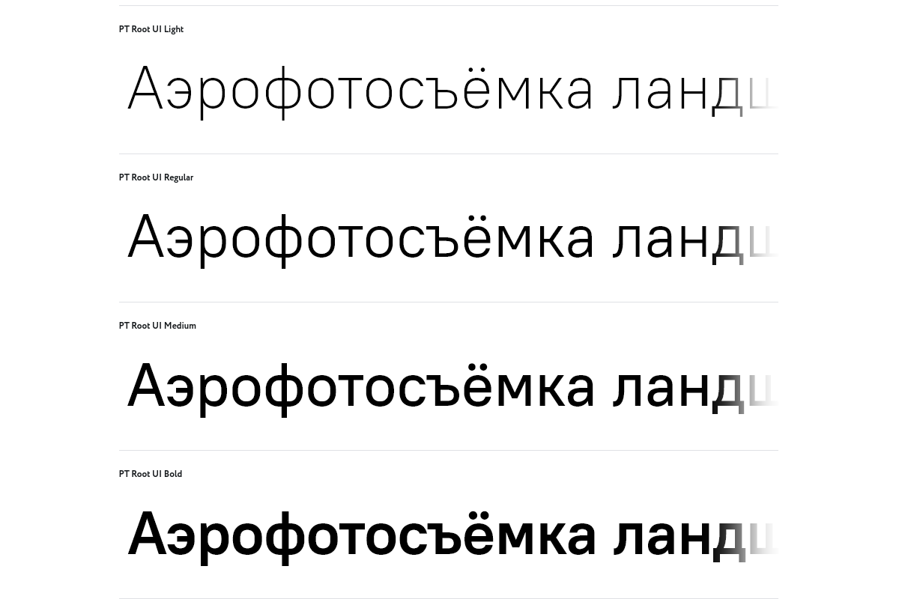

# PT Root UI


## Styles
* light
* regular
* medium
* bold

Downloaded from [https://www.paratype.ru/fonts/pt/pt-root-ui](https://www.paratype.ru/fonts/pt/pt-root-ui)

## Use
```sh
yarn add kokkekpek/pt-root-ui-font
```

```ts
import 'pt-root-ui-font/light.css.css'
import 'pt-root-ui-font/regular.css'
import 'pt-root-ui-font/medium.css'
import 'pt-root-ui-font/bold.css'
```